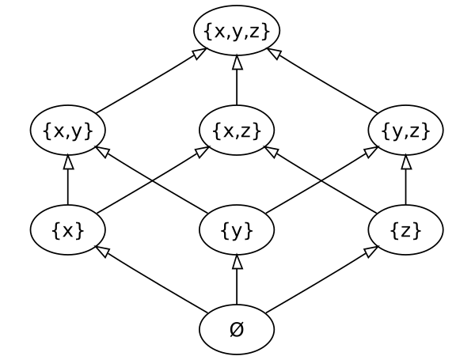

## CRDT - Conflict-free Replicated Data Type

### Реализация одного из базовых алгоритмов для синхронного обновления данных - GCounter

* Множество данных: натуральные числа: $\mathbb{N}$
* Минимальный элемент: $-\infty$
* функция слияния: $merge(x, y) = max(x, y)$

#### Такие требования дают нам коммутативную и идемпотентную функцию слияния, которая монотонно растёт на заданном множестве данных:

#### Это гарантирует, что реплики рано или поздно сойдутся и позволяет не беспокоится о протоколе передачи данных — мы можем терять сообщения с новым состоянием, отправлять их несколько раз, и даже отправлять в любом порядке.

#### Для реализации испольщованы следующие тайпклассы из cats-effect:
* Semigroup
* CommutativeMonoid
* BoundedSemiLattice - ограниченная полурешетка, через CommutativeMonoid (собственная реализация)